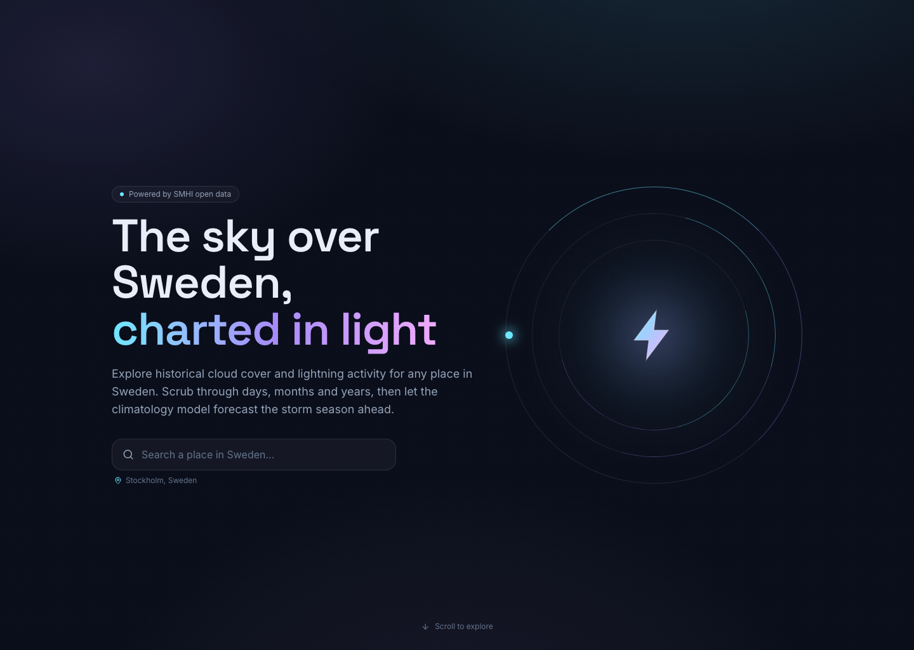

# Skyfall — Cloud & Lightning Atlas

A kinetic, scroll-driven web app that visualizes **historical cloud cover** and
**lightning-strike activity** for any location in Sweden, using
[SMHI open data](https://opendata.smhi.se/). Scrub through **Day / Month / Year**
views and get a **deterministic climatology forecast** of the storm season.

Built with React + Tailwind, Framer Motion + Lenis for motion, bespoke animated
SVG charts, and a Cloudflare Pages Functions backend (KV-cached). Infrastructure
is provisioned with Terraform.



## Features

- **Search any place in Sweden** (geocoded via OpenStreetMap Nominatim).
- **Cloud cover** in oktas (0–8) from the nearest SMHI weather station.
- **Lightning** strike counts, a true-distance "radar" of individual strikes,
  and a storm-day probability gauge — filtered to a configurable radius.
- **Day / Month** aggregation with a kinetic, interaction-driven UI.
- **Climatology forecast**: a deterministic, no-black-box model built from the
  last 5 years of history at the selected location.
- Smooth scroll, pointer-driven "balance & rotation", micro-interactions,
  full responsiveness, and `prefers-reduced-motion` support.

## Tech stack

| Layer        | Choice                                                        |
| ------------ | ------------------------------------------------------------ |
| Frontend     | React 19 + TypeScript, Vite (`vite-plus`)                    |
| Styling      | Tailwind CSS v4                                              |
| Motion       | `motion` (Framer Motion) + `lenis`                          |
| Data         | TanStack Query                                              |
| Charts       | `d3-scale` / `d3-shape` math + custom animated SVG          |
| Backend      | Cloudflare Pages Functions + Workers KV                      |
| Infra        | Terraform (`cloudflare` provider)                           |

## Architecture

```
Browser SPA ──▶ /api/* (Cloudflare Pages Functions) ──▶ SMHI APIs + Nominatim
                       │
                       └──▶ Workers KV (caches immutable daily source files)
```

The browser only talks to our own `/api/*` endpoints. Functions fetch SMHI data
server-side, filter strikes by radius, aggregate by Day/Month/Year, and cache
the raw daily source files in KV (they're immutable historical data).

### API endpoints

| Endpoint          | Purpose                                                       |
| ----------------- | ------------------------------------------------------------ |
| `/api/geocode`    | Address → lat/lon (Nominatim proxy, cached)                  |
| `/api/lightning`  | Strike counts + probability + sampled strikes for a range    |
| `/api/cloudcover` | Mean cloud cover (oktas) from the nearest station            |
| `/api/forecast`   | Deterministic monthly climatology (probability + cloud band) |

## Data sources & attribution

- **Lightning**: [SMHI Lightning archive](https://opendata.smhi.se/lightning/archive/introduction)
  (daily nationwide strike files, 2012–present).
- **Cloud cover**: SMHI Meteorological Observations, parameter **16**
  ("Total molnmängd", hourly oktas), corrected archive + latest months.
- **Geocoding**: [OpenStreetMap Nominatim](https://nominatim.org/).

SMHI open data is published under the SMHI terms and conditions; please review
them before redistributing data.

## Local development

Requirements: Node 20+, pnpm 11.

```bash
pnpm install

# UI + Functions together on http://localhost:8788 (Vite HMR + /api routes)
pnpm dev:api

# UI only on http://localhost:5173 (/api proxied to :8788 when dev:api is running)
pnpm dev
```

`pnpm dev:api` runs `wrangler pages dev`, which serves the Vite dev server and
the `functions/` directory with a **local** KV simulation — no Cloudflare
account needed for local work.

## Build

```bash
pnpm build      # tsc + production bundle into dist/
pnpm preview    # preview the production build
```

## Deployment

### 1. Provision infrastructure (Terraform)

```bash
cd infra
cp terraform.tfvars.example terraform.tfvars   # set account_id, project_name
export CLOUDFLARE_API_TOKEN=...                 # token with Pages + KV edit rights

terraform init
terraform apply
```

Terraform creates the Workers KV namespace and the Pages project (with the
`CACHE` KV binding wired for preview + production). Note the outputs:

```bash
terraform output kv_namespace_id   # paste into wrangler.toml [[kv_namespaces]].id
terraform output pages_url
```

### 2. Deploy the site

Put the `kv_namespace_id` into [`wrangler.toml`](wrangler.toml), then:

```bash
pnpm deploy        # pnpm build && wrangler pages deploy dist
```

(Or connect the Git repo to the Pages project for CI builds with
`pnpm build` as the build command and `dist` as the output directory.)

## Notes & limitations

- **Yearly view** loads up to ~365 SMHI daily lightning files on first request.
  The backend batches fetches to stay within Cloudflare's free-tier subrequest
  limit (50/request) and caches both raw days and aggregated responses in KV.
  The first load for a new year can take 30–90 seconds; repeats are instant.
  For demos, pick a completed past year (e.g. 2023) and load it once before
  presenting.
- **Recent cloud data**: SMHI's corrected archive omits roughly the last 3
  months; the app merges the "latest-months" series to fill the gap, but the
  most recent days may still be sparse for some stations.
- **Coverage**: data is Sweden-focused (SMHI is the Swedish weather service).

## Demo deployment (free tier)

You already have the right backend shape: **Cloudflare Pages Functions + KV**.
No separate server is required for a demo.

| Concern | Free-tier approach |
| -------- | ------------------- |
| API proxy + SMHI keys | Pages Functions (included with Pages) |
| Cache raw SMHI files | Workers KV (free tier: 100k reads/day, 1k writes/day) |
| Yearly lightning | Batched subrequests (45/batch) + response cache in KV |
| Cold first load | Pre-warm before demo: open Year view for your location once |
| CPU/time limits | Keep radius ≤ 100 km; use past years not current year |

**Do you need another backend?** No — a lightweight proxy is mandatory (SMHI
CORS, geocoding, aggregation), and you already have one. Adding e.g. Railway
or Fly.io would cost money and duplicate what Pages Functions do. Optional
*free* upgrades if a demo outgrows limits:

1. **Pre-warm script** — run `curl` against `/api/lightning?granularity=year&…`
   for Stockholm + your demo year before the presentation (fills KV).
2. **GitHub Actions cron** — weekly job hits popular endpoints to keep KV warm
   (still $0 on Cloudflare free + GitHub free).
3. **Static pre-aggregation** — for a fixed demo location/year, commit a JSON
   snapshot under `public/demo/` and fall back when `?demo=1` (zero SMHI calls
   during the talk).
4. **Client-side month fan-out** — if you hit Worker CPU limits, split year
   into 12 parallel month requests from the browser (each ≤ 31 subrequests).

For a one-off demo on Cloudflare free tier, **(1) pre-warm + response caching**
is usually enough.

## Project structure

```
src/                 React app
  components/         UI + charts (LocationSearch, SegmentedToggle, charts/…)
  sections/           Page sections (Hero, CloudCover, Lightning, Forecast…)
  hooks/ lib/ state/  Data hooks, helpers, app state
functions/
  api/                Pages Functions (geocode, lightning, cloudcover, forecast)
  lib/                SMHI client, caching, geo math, aggregation, forecast model
shared/types.ts       DTOs shared by app + functions
infra/                Terraform (KV namespace + Pages project)
```
